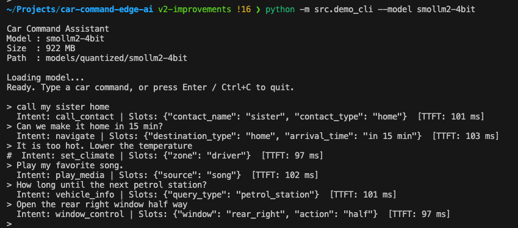

# Car Command Edge AI

> Fine-tuning, quantizing, and benchmarking small language models for on-device car voice command understanding — Apple Silicon (M4 Pro).

---

## What It Does

An end-to-end edge AI pipeline that takes a natural language car command and produces structured intent + slot JSON:



Three compact LLMs are fine-tuned with LoRA, quantized to 4-bit and 8-bit, and benchmarked across 9 variants for latency, memory, accuracy, and energy.


---

## Models & Stack

| | |
|---|---|
| **Models** | Llama 3.2 3B · Qwen 2.5 3B · SmolLM2 1.7B |
| **Fine-tuning** | MLX-LM LoRA — native Apple Silicon, Metal backend |
| **Quantization** | 4-bit and 8-bit MLX format |
| **Dataset** | Synthetic — 14 intents, ~1,200 utterances (Ollama `llama3.1:8b`) |
| **Hardware** | Apple M4 Pro (~273 TOPS) |

Target cockpit SoC: 30–50 TOPS, ≤16 GB RAM.

---


## Pipeline

```
generate_dataset.py   Ollama llama3.1:8b → 14 intents, ~1,200 utterances
                      Density tiers (full/partial/minimal) + inline validation
                      Stratified 80/20 split → train.jsonl / test.jsonl
        │
        └─► finetune_mlx.py    MLX-LM LoRA — 3 models, native Apple Silicon
                │
                └─► quantize.py    4-bit + 8-bit per model → 6 quantized variants
                        │
                        └─► benchmark.py    9 variants: TTFT · TPS · RAM · accuracy · energy
                                │
                                └─► demo_cli.py    text input → structured JSON output
```

---

## Key Results

| Variant | Size (MB) | TTFT (ms) | RAM (MB) | Intent acc | Slot F1 | Energy/token |
|---------|----------:|----------:|---------:|-----------:|--------:|-------------:|
| **smollm2-4bit** | **922** | **54.1** | **1,103** | 96.5% | 79.4% | **0.029 mWh** |
| smollm2-8bit | 1,738 | 66.2 | 1,972 | 98.3% | 83.8% | 0.041 mWh |
| qwen-4bit | 1,667 | 131.4 | 1,833 | 98.3% | **83.8%** | 0.059 mWh |
| qwen-8bit | 3,138 | 152.0 | 3,412 | **99.6%** | 83.3% | 0.080 mWh |
| llama-4bit | 1,740 | 120.4 | 1,930 | 94.3% | 74.1% | 0.056 mWh |

- **smollm2-4bit** is the best edge candidate: smallest (922 MB), fastest (54.1 ms TTFT), most energy-efficient (0.029 mWh/token), and the only variant that stays always-resident in an 8 GB cockpit SoC alongside OS and navigation. Add a JSON parse fallback (1.3% parse failure rate).
- **Total response time — not TTFT — is what the TTS pipeline sees.** TTFT + (output_tokens / TPS): smollm2-4bit ~202 ms, qwen-4bit ~342 ms. smollm2-4bit is the only 4-bit variant within the 200 ms automotive target end-to-end.
- **Qwen achieves the highest intent accuracy** (98.3–99.6%) at every quantization level. 4-bit accuracy cost: Qwen −1.3%, SmolLM2 −1.8%, Llama −3.1%. 8-bit is lossless for Qwen and SmolLM2, near-lossless for Llama (−0.5%), while cutting size ~47%.
- **Slot F1** (precision/recall at the key-value level) is 74–84% across variants — a more honest measure than exact-match slot accuracy, which penalises any extra slot the model generates even if it is plausible.

> **Benchmark vs interactive TTFT:** Benchmark numbers are measured back-to-back with no idle time, keeping Metal compute units active. In interactive use, GPU clock ramps down between queries, adding ~50 ms. Interactive TTFT for smollm2-4bit: 97–103 ms — well within the 200 ms target.

---

## 📄 Docs

| | |
|---|---|
| **[Full Results & Analysis](docs/RESULTS.md)** | Fine-tuning, quantization, benchmark table, per-intent slot accuracy breakdown |
| **[Model Card](docs/MODEL_CARD.md)** | Architecture, training details, limitations, recommendations |
| **[Setup Guide](docs/SETUP.md)** | Environment setup, dependencies, and reproduction steps |

---

## Dataset

Synthetic car commands generated via Ollama (`llama3.1:8b`), covering 14 intents across three slot-density tiers. The generator was rewritten from a flat-batch approach after the v1 dataset produced 13.7% empty-slot examples and ~18% status/query utterances — neither of which are valid car commands.


Each intent is generated in **full** (maximum slots), **partial** (mid-range), and **minimal** (single-slot) tiers with tier-specific gold examples embedded in the prompt. Inline validation at generation time rejects None-valued slots, out-of-schema keys, and question/status utterances — no post-hoc cleaning pass needed.

| Command | Intent | Slots |
|---------|--------|-------|
| `Cool the front down to 20.` | `set_climate` | `{"zone": "front", "temperature": 20, "mode": "cool"}` |
| `Turn the heat up on all seats to high` | `seat_control` | `{"heat": "high", "seat": "all"}` |
| `Open the sunroof about halfway.` | `window_control` | `{"window": "sunroof", "action": "open", "percentage": 50}` |
| `Navigate to the nearest gas station` | `navigate` | `{"destination_type": "gas_station"}` |
| `Enable lane assist` | `safety_assist` | `{"feature": "lane_assist", "action": "enable"}` |
| `Switch to sport, please` | `drive_mode` | `{"mode": "sport"}` |

**~1,200 utterances · 14 intents · ~960 train / ~240 test · stratified 80/20 split**

---

## Quick Start

```bash
# Install dependencies (Python 3.11+, Apple Silicon Mac)
pip install -r requirements.txt

# Generate dataset (requires Ollama + llama3.1:8b)
ollama serve
python -m src.generate_dataset

# Fine-tune all three models (MLX-LM LoRA)
python -m src.finetune_mlx

# Quantize to 4-bit and 8-bit
python -m src.quantize

# Benchmark all 9 variants (per-process for accurate RAM)
bash scripts/run_benchmark.sh

# Run the interactive demo
python -m src.demo_cli --model smollm2-4bit
```

> Requires `HF_TOKEN` in `.env` for Llama 3.2 3B (gated model). See `.env.example`.


---

## Project Structure

```
src/
├── generate_dataset.py  # Synthetic dataset generation via Ollama (density tiers)
├── finetune_mlx.py      # MLX-LM LoRA fine-tuning (active pipeline)
├── quantize.py          # MLX 4-bit and 8-bit quantization
├── benchmark.py         # Latency, throughput, memory, accuracy, energy
├── demo_cli.py          # Interactive car command demo
└── utils.py             # Shared config, INTENT_SCHEMA, and helpers
docs/
├── RESULTS.md           # Full benchmark results and analysis
├── MODEL_CARD.md        # Model card with training details and limitations
└── SETUP.md             # Environment setup and reproduction guide
```

---

Licensed under the [MIT License](LICENSE).

---

🤖 Logic co-authored by [Claude Code](https://claude.ai/code).
🧠 Final implementation, validation and technical responsibility: Prachi Govalkar.
